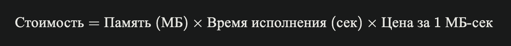

# FaaS

## Запуск

```bash
make setup
```

## Запуск функий и тарифы
### Функции

Для запуска функции достаточно предоставить готовый Docker образ и env-параметры для его запуска, а также tenant (почта в нашем случае), чтобы мы могли отслеживать кто и когда запустил функцию. А также слать итоговые письма на нужную почту

```bash
curl -X POST localhost:8080/v1/functions/run -d '{"image_name": "ealen/echo-server:latest", "email": "romanchechyotkin@gmail.com"}'
```

### Цены и тарифы
[Swagger docs для сервиса цен и тарифов](http://localhost:8085/swagger/index.html#/)

Мы сделали отдельный сервис, который отвечает за цены и тарифы. Перед вами базовый CRUD, вы можете создавать разные тарифы, указывать им разные цены за CPU, Memory, Execution и тд. На случай, если захотите делать разные ценовые планы с разными ценами.



Для расчета стоимости именно по памяти используется данная формула. Берем сколько суммарно использовалось памяти за все исполнение функции и умножаем на фикс прайс памяти

Чтобы получить свои счета можно сделать запрос
```bash
curl localhost:8081/billing/romanchechyotkin@gmail.com | jq .
```

## Архитектура


Компоненты

- Control plane - предоставляет REST API endpoint для запуска функций, запускает функции в Kubernetes и отправляет события деплоя в Kafka

- Price service - REST API, отвечающее за хранение и управление (CRUD) тарифами. Доступен только Faas admin.

- Invoicer - сервис биллинга для расчета стоимости использования функций на основе метрик. Запрашивает агрегированные метрики использования ресурсов из ClickHouse.
Предоставляет HTTP API для получения биллинговой информации по тенанту. Отправляет уведомления с расчетом стоимости в Kafka при остановке функций

- Notifier - сервис для оповещения пользователей о должном платеже по email. Данные принимаются в потребительскую группу из Kafka (в которую в свою очередь, производит JSON сервис invoicer) и отправляются пользователю

- Meter agent - Агент для сбора метрик контейнеров и отправки их на Meter сервер через UDP.

- Meter - UDP сервер для приема метрик и роутинга их в Kafka топики.
